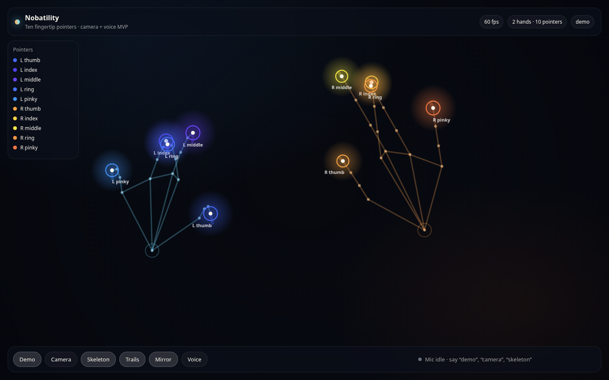
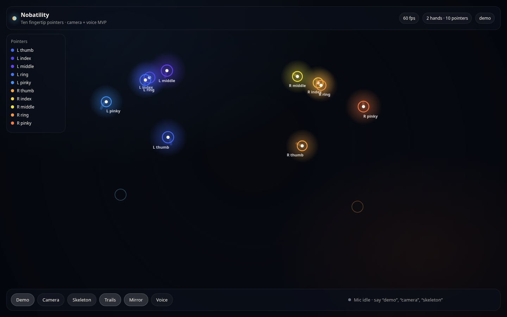
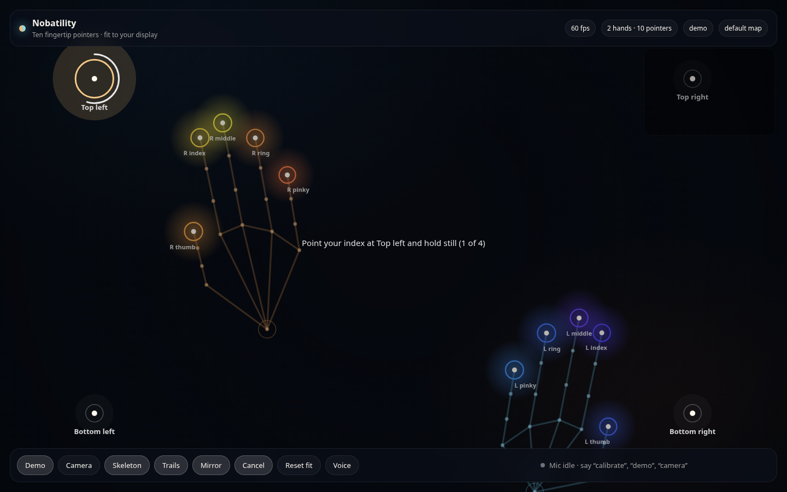
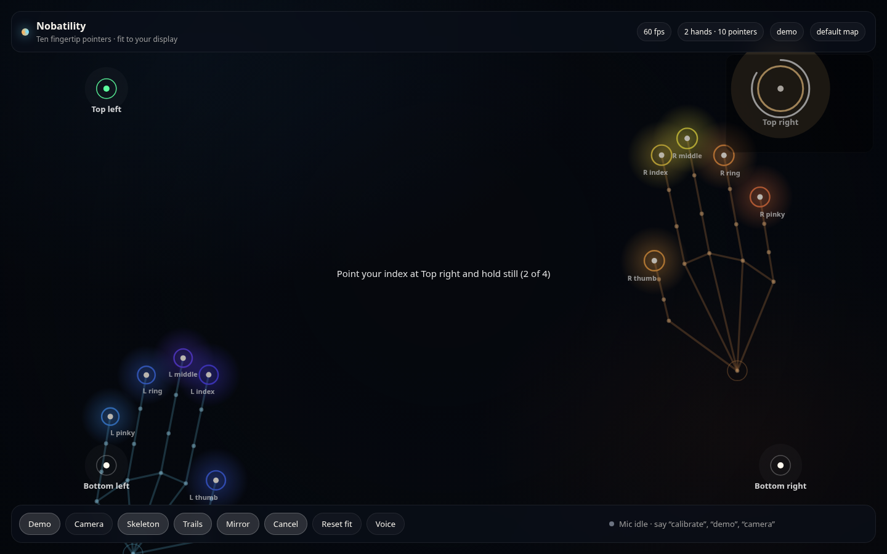
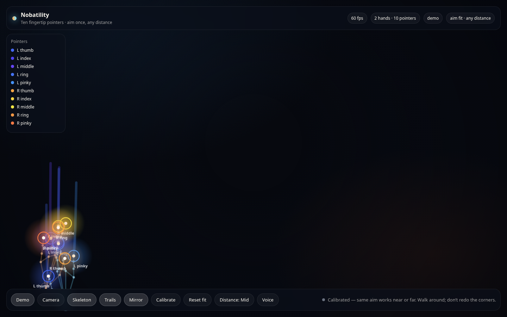
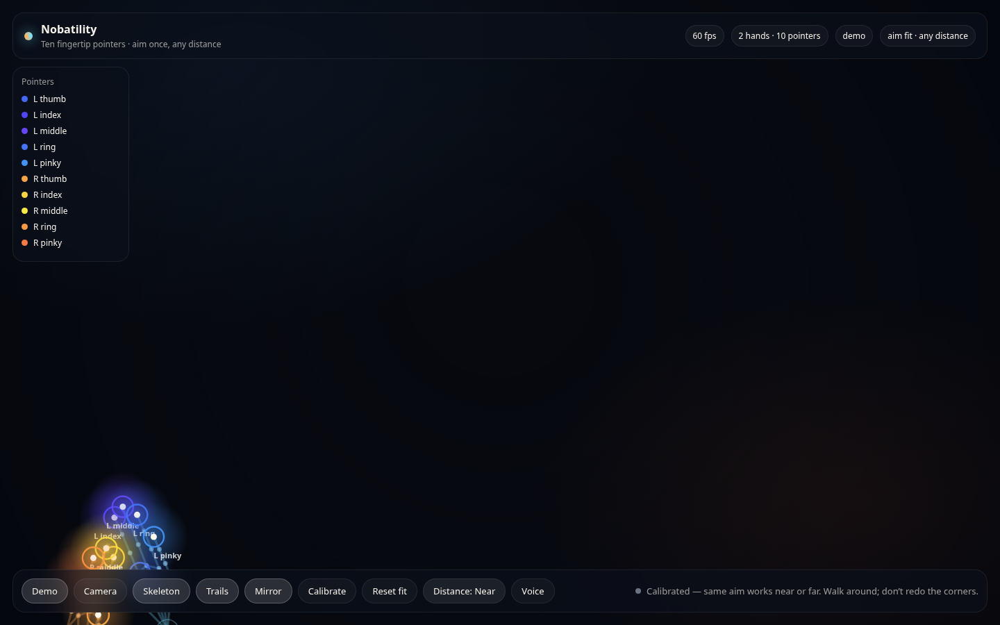

# Nobatility

Far-field **finger + voice** overlay for a Mac. Not a single cursor: up to **ten fingertip pointers**, skeletons, trails, voice, and a **4-corner display fit** in the same family as Apple Head Pointer.



## What you get today

- **Demo mode** — two kinematic hands, all 10 named pointers, no camera required
- **Camera mode** — MediaPipe Hand Landmarker, 21 points per hand, two hands
- **Calibration** — aim your index at four marks once; we fit **pointing direction** so the same pose works near or far
- **Overlay** — per-finger color, labels, trails, pinch rings
- **Voice** — “calibrate”, “demo”, “camera”, “skeleton”, “trails”, “mirror”, “reset calibration”
- **Smoothing** — One Euro filter on live landmarks



Controlling Finder, clicking, dragging, and accessibility APIs are still out of scope.

## Run it on your Mac

Chrome or Edge (MediaPipe WASM). Safari can run **demo** and calibration; live hands want Chromium.

```bash
npm install
npm test
npm run dev
```

Fullscreen the tab (`Control-Command-F`). Stand where you’ll actually use it, hit **Camera**, then **Calibrate**.

### Fit once, then walk around

Uncalibrated mapping is a selfie-mirror plus a guessed inset — it follows **where the hand sits in the webcam frame**, so it breaks when you step closer or farther.

Calibration records **where the index finger is aiming** (MCP → tip in 3D), not the blob’s pixel. Head Pointer does the same idea with head *orientation*. After four corners:

1. Status reads **aim fit · any distance**.
2. Walking toward or away from the display should not require a redo — same pointing pose, same screen spot.
3. Demo **Distance: Far / Mid / Near** (key `f`) only changes how large the hands are in the frame so you can see that.

Pixel-homography saves from the previous build (`calibration.v1`) are ignored; fit again once.

1. Four marks: top-left, top-right, bottom-right, bottom-left.
2. **Aim** your index at the glow and hold ~1s (`Space` or click to lock).
3. Saved in `localStorage`. **Reset fit** to clear.





After a fit, Demo **Distance** only changes how large the hands are in the frame; the pointers stay put:





| Key | Action |
| --- | --- |
| `k` | Calibrate / cancel |
| `Space` | Lock current corner |
| `Escape` | Cancel calibration |
| `f` | Demo distance (far / mid / near) |
| `d` | Demo |
| `c` | Camera |
| `s` / `t` / `m` | Skeleton / trails / mirror |

**Reset fit** returns to the default inset map.

Everything runs **on device**.

## How this compares to Head Pointer

| Head Pointer | This |
| --- | --- |
| Face / head pose | Hands, 21 landmarks each |
| One pointer | Ten fingertip pointers |
| System-wide accessibility cursor | In-page overlay (no event injection yet) |
| Move to each edge / corner | Aim index at four marks (3D bone, not pixels) |
| Heavy smoothing | One Euro on each landmark |

## What it would take to actually drive the Mac

1. **Native overlay** — `NSPanel` over all Spaces, click-through.
2. **Vision** — `VNDetectHumanHandPoseRequest`, or keep MediaPipe in a helper.
3. **Control policy** — dominant index = pointer, pinch = click; other eight stay visual/gestures.
4. **Voice** — `SFSpeechRecognizer` → Accessibility / `CGEvent`.
5. **Permissions** — Camera, Microphone, Accessibility.

## Repo layout

```
src/hands/          demo, MediaPipe, calibration guide pose
src/render/         canvas overlay + corner marks
src/calibration.ts  dwell session + localStorage
src/homography.ts   4-point DLT
src/mapping.ts      default inset map or fitted homography
src/voice/
docs/screenshots/  README captures
```
